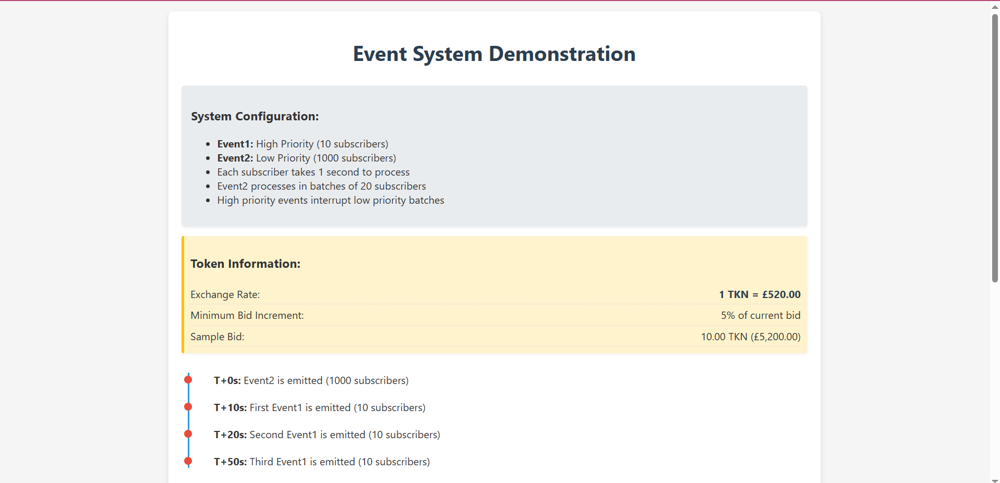
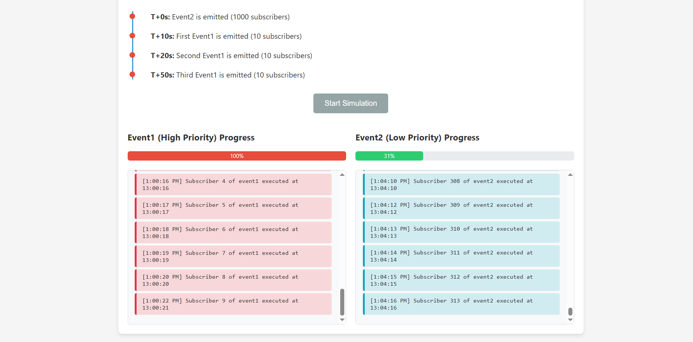

# Priority-Based Event System

A modern implementation of an event system with priority handling for different types of events and subscribers.



## Overview

This application demonstrates a sophisticated event system that handles events with different priorities:

- **High Priority Events**: Processed immediately, interrupting any low-priority processing
- **Low Priority Events**: Processed in batches, allowing for interruption by high-priority events

## Features

### Event Handling

- **Event1 (High Priority)**: 10 subscribers, notified immediately when emitted
- **Event2 (Low Priority)**: 1000 subscribers, processed in batches of 20
- **Interruption Mechanism**: High-priority events pause low-priority processing
- **Resumption**: Low-priority processing continues after high-priority events complete

### Token System Integration

As per system requirements:

- **Exchange Rate**: 1 TKN = £520.00 British Pounds
- **Display Format**: 
  - Token values shown with 2 decimal places and "TKN" suffix
  - Fiat values displayed in GBP format with £ symbol
- **Minimum Bid Increment**: 5% of current bid



## Getting Started

### Prerequisites

- Python 3.7+
- Flask

### Installation

1. Clone this repository:
   ```bash
   git clone https://github.com/OckiyaCliff/Eric-EventChallengegit
   cd priority-event-system
   ```

2. Install dependencies:
   ```bash
   pip install -r requirements.txt
   ```

### Running the Application

1. Start the Flask server:
   ```bash
   python app.py
   ```

2. Open your browser and navigate to:
   ```
   http://localhost:5000
   ```

3. Click the "Start Simulation" button to begin the demonstration

## Simulation Timeline

The test case follows this sequence:
- **T+0s**: Event2 emitted (1000 subscribers)
- **T+10s**: First Event1 emitted (10 subscribers)
- **T+20s**: Second Event1 emitted (10 subscribers)
- **T+50s**: Third Event1 emitted (10 subscribers)

## Technical Implementation

### Architecture

The application consists of three main components:

1. **Event System Core** (`event_system.py`)
   - Manages subscribers and event queues
   - Implements priority-based processing logic
   - Handles threading and synchronization

2. **Web Backend** (`app.py`)
   - Flask application providing API endpoints
   - Manages the simulation timeline
   - Uses Server-Sent Events (SSE) for real-time updates

3. **Interactive Frontend** (`templates/index.html`)
   - Visualizes event processing in real-time
   - Displays progress bars and event logs
   - Shows timeline of event emissions

### How It Works

1. When a high-priority event is emitted, it pauses any ongoing low-priority processing
2. High-priority subscribers are notified immediately
3. After high-priority processing completes, low-priority processing resumes
4. Low-priority events are processed in batches to allow for interruption

## Use Cases

This pattern is valuable in various scenarios:

- **Financial Systems**: Processing critical trades vs. routine updates
- **Monitoring Applications**: Handling alerts vs. regular status updates
- **Message Queues**: Managing urgent messages vs. bulk notifications
- **Resource Management**: Allocating resources based on task priority